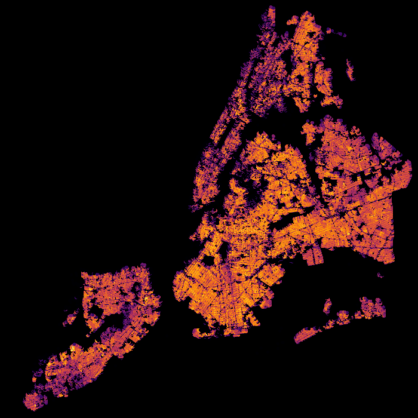

# Final Project Proposal #

* **Kai S. Lukowiak**
* **DATA 608**
* **2018/03/25**

## Background ##

Election data in Anglo-America is generally first past the post. In other areas,
governments are formed with proportional representation. Both of these are rather
banal when it comes to visualization. A more interesting graphical experience
comes from ranked ballot choices. In these elections, we can see voter's true
preferences.

## Election ##
The 2018 Ontario Progressive Conservative leadership race is one of the examples
where we can visualize a ranked ballot. (Other examples like France's
presidential elections are not ranked and so require polling to see where voters
moved to after their prefered candidate was eliminated.)

## Data ##

[The results can be found here.](https://en.wikipedia.org/wiki/Progressive_Conservative_Party_of_Ontario_leadership_election,_2018)

The article contains both the results by county and the aggregated results.

## Proposal ##

I propose to create two main plots. The first one will be a [Sankey](https://blog.ouseful.info/2017/11/28/quick-round-up-visualising-flows-using-network-and-sankey-diagrams-in-python-and-r/)
 plot.

The second will be a [Choropleth](https://en.wikipedia.org/wiki/Choropleth_map) Showing polling data by riding.

Given the multidimensional nature of this, I foresee needing to use a gif or
or animation to show the changes in ballots over time.

## Why this dataset?

The winner of the election (Doug Ford) is part of a minor political dynasty in
Canada. His brother sparked controversy by smoking crack while in the office of the
mayor of Toronto. Mr Ford's politics are generally described as populist and
unconventional.

I want to understand, through visualization, how the preferences of voters found
common ground with Ford after candidates they prefer was eliminated.
